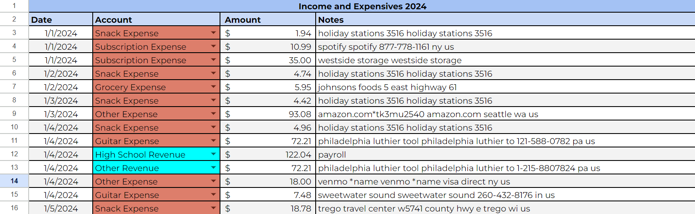

# Finance-Format-to-Sheets
This is/will be a small project that takes information from my bank statements, formats it via Python into a readable .csv file, and inputs it into a Google Sheets file.

## Final Result

## Moving Forward
At the moment, the program is useable. It's not entirely accurate, and there are still some elements I have to do manually. 
Overall, however, it's a super baller, and I'm satisfied with my work. 
